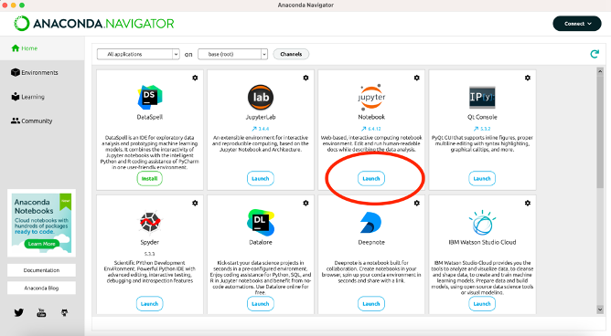
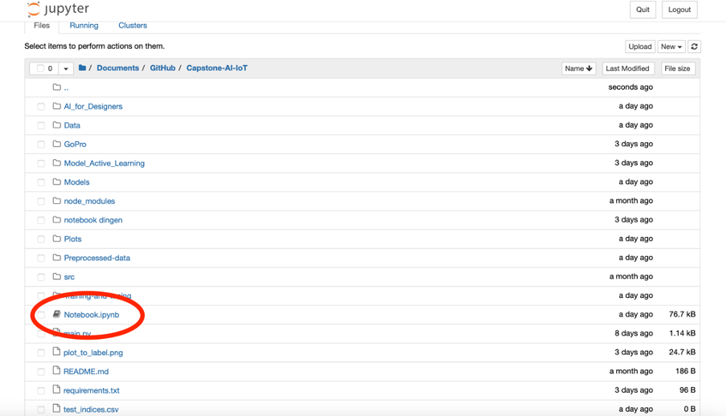
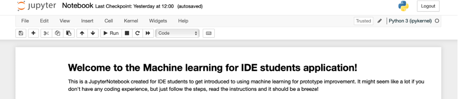

# Installation guide
## 1. Installing Python
Setting up your device might seem a lot if this is your first experience working with Python, that’s why we created these instructions to guide you through all necessary installation steps. 

Python is a programming language. The way you will be able to use it to run programs is through an application called Jupyter Notebook. You’ll notice later on in the Notebook that it consists of text, as well as code blocks. In the text you will find instructions, and if you run the code blocks, you’ll actually execute our program. This is the program that uses machine learning algorithms to help you analyze how people use your prototype.

To install Python, we recommend you to use Anaconda. Click [this link](https://www.anaconda.com/) to download the Python installer. 

## 2. Opening the Notebook
After you’ve installed Anaconda, open the Anaconda Navigator application. You will see the homepage, where you need to select Jupyter Notebook:

Anaconda will start your browser and open this page in a new tab, where you will see all of your documents. All that’s left to do now is open the right file.

Make sure you’ve downloaded the Notebook and code files. In our example, we saved the documents in a folder called Capstone-AI-IoT. The Notebook can be found under the directory _C:/Users/<name>/Documents/GitHub/Capstone-AI-IoT/_**Notebook.ipynb**. It’s important that you saved the files on the same drive where you installed Anaconda. In this example we saved it on the C drive, so Anaconda needs to be installed there as well.
  

After clicking it, Anaconda will open a new tab. Note that the extension should be .ipynb, not .py! The Notebook looks like this:
  

  
Here, you will find further instructions. Good luck!
