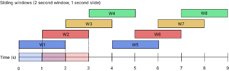
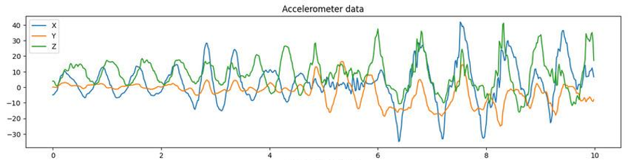

# Preprocessing Technicalities

The raw data you collected is messy and cannot be understood by the model very well. To get an understanding of this data, we need to perform preprocessing. 

The format is important because Python needs to be able to work with the data. But more importantly is the feature extracting. This is a process in which you derive values from raw data. An example could be an average from a set of numbers. This will make sure the model has enough relevant data which improves accuracy and reliability, reduces overfitting and speeds up training. We did this process in a couple of steps explained below.

## Windowing
We started off with windowing the data; taking an interval from which we extract features. We used sliding windows, which means that the different windows overlap to make sure activities are caught even if they don’t fit one of the windows. As you can see, window W2 overlaps partially with W1 and W3 After processing a window we shift the window some amount of time in the future and extract this data, until the end of the full data stream is processed. As you can see in figure 1 below, the window size is two seconds and the slide time is one second. By using a sliding window we can give every window a classification about what is being done in that particular window.

For example, when an activity is happening between one and three seconds, windows W1 and W3 would not be able to correctly classify this activity with a high certainty. W2 however can because it sees the whole action.

## Time domain
After we make a new window, we process it in a couple of different so-called domains. One of which is the time domain. The time domain is actually pretty simple. It is the normal graph we get when plotting the sensor data. It shows the amplitude against the time. It looks like the figure 2 beneath.

We extract the following features represented in the table below:

| Feature              | Explanation                                    |
|----------------------|------------------------------------------------|
| Minimum              | The lowest point of the graph                  |
| Maximum              | The highest point of the graph                 |
| Average              | Average of the data points in the window       |
| Standard deviation   | Standard deviation of the values in the window |
| Area under the curve | Area that is under the graph                   |

## Frequency domain
The frequency domain is more complicated. Because the time domain consists of a combination of a lot of sinus components, we can extract these individual components by the use of a fourier transformer. We won’t explain the whole process of this, but it is a well known method for example extracting WiFi signals, isolating audio and improving images. We will use it to extract additional features that are hidden from us in the time domain.

