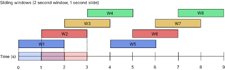
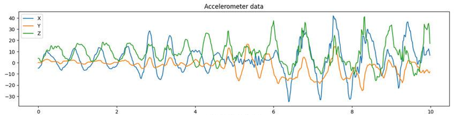
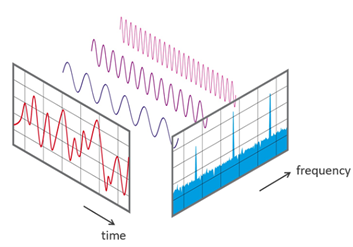
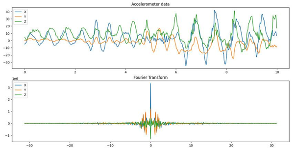

# Preprocessing Technicalities

The raw data you collected is messy and cannot be understood by the model very well. To get an understanding of this data, preprocessing is needed. 

The format is important because Python needs to be able to work with the data in a way that is always similar, regardless of the original. But more importantly is the feature extracting. This is a process in which values are derived from the raw data. An example could be taking the average from a set of numbers. This will make sure the model has enough relevant data which improves accuracy and reliability, reduces overfitting and speeds up training. The process of preprocessing that is used during this project is described below.

## Windowing
First, the data is windowed, i.e.: taking a small part of the data from which the features are extracted. To have as many windows as possible, sliding windows were used, which means that the different windows overlap to make sure activities are caught, even if they don’t fit one of the windows. As can be seen in the figure below, window W2 overlaps partially with W1 and W3 After processing a window the window is shifted some amount of time in the future and the features are extracted, until the end of the full data stream is processed. In the figure, the window size is two seconds and the slide time, or offset, is one second. By using a sliding window, each window will be classified with regards to what is being done in that particular window.

For example, when an activity is happening between one and three seconds, windows W1 and W3 would not be able to correctly classify this activity with a high certainty. W2 however can because it sees the whole action.

## Time domain
After a window is made and the data that is in that particular window is collected from the files containing the sensor data, the features are extracted. In total five features from the time-domain and three features from the frequency-domain are extracted. The time domain is the graph that can be obtained when the sensor data is plotted. It visualizes the amplitude (y-axis) set out against the time (x-axis). An example of graph is shown in the figure below, where a phone moved, while recording the accelerometer data.

The features per axis of each sensor that are extracted in the time-domain are represented in the table below:

| Feature              | Explanation                                    |
|----------------------|------------------------------------------------|
| Minimum              | The lowest point of the graph                  |
| Maximum              | The highest point of the graph                 |
| Average              | Average of the data points in the window       |
| Standard deviation   | Standard deviation of the values in the window |
| Area under the curve | Area that is under the graph                   |

## Frequency domain
The frequency domain is more complicated. Each signal can be expressed as a sum of sines and cosines with different frequency components. These individual frequency components and its amplitude can be found by the use of a fourier transform. The process of calculating the components will not be explained in this report, but it is a well known method that is used to extract wifi signals, for isolating audio and to improve the quality of images for example. In this preprocessing step, it is used to extract additional features that are hidden in the time domain.

After the Fourier transformation, the contribution of the different frequencies that are part of the time domain can be seen. This data can give the most important frequency, which could be different for some or every activity. Below is an example.

Features extracted from the frequency domain are the following:

| Feature              | Explanation                                                                                   |
|----------------------|-----------------------------------------------------------------------------------------------|
| Centroid frequency   | The point where the total power right from that point is equal to the left part of that point |
| Maximum power        | The maximum power of the sensors                                                              |
| Peak value frequency | Most present frequency                                                                        |

After having extracted all these features from the X, Y and Z axis of both the accelerometer and gyroscope, there are 48 extracted features (8 basic features * 3 axis * 2 sensors).

After extracting features from every window in the time and frequency domain, preprocessing is done and model training can start. 

